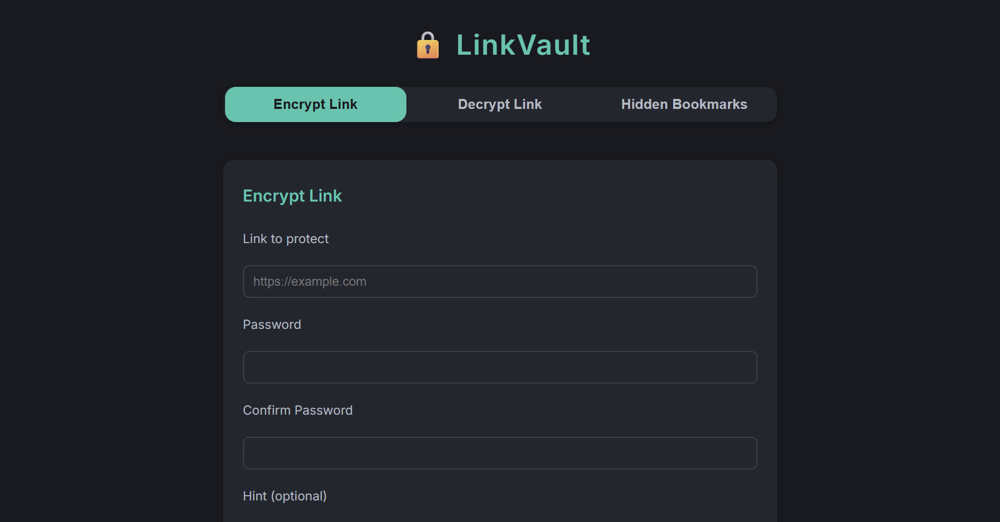

# 🔒 LinkVault

A modern, privacy-first web app to **encrypt, protect, and disguise your links and bookmarks**. All encryption is done client-side—your secrets never leave your browser.

---



## Features

- **Password-protected links**: Encrypt any URL with a password. Only those with the password can unlock it.
- **Hidden/disguised bookmarks**: Create bookmarks that look like any site, but secretly point to your encrypted link.
- **Client-side cryptography**: All encryption/decryption happens in your browser. No data is sent to any server.
- **Modern, responsive UI**: Works beautifully on desktop and mobile.
- **No sign-up, no tracking, no ads**: 100% privacy-focused.

## How It Works

1. **Encrypt a Link**: Enter a URL and password. LinkVault generates a secure, encrypted link you can share.
2. **Decrypt a Link**: Paste an encrypted link and enter the password to unlock the original URL.
3. **Hidden Bookmarks**: Disguise your encrypted link as a bookmark to any site (e.g., "Gmail"). Only you know the secret.

All cryptography uses the [Web Crypto API](https://developer.mozilla.org/en-US/docs/Web/API/Web_Crypto_API) and strong AES-GCM encryption.

## Quick Start

1. **Clone or Download**
   ```bash
   git clone https://github.com/yourusername/linkvault.git
   cd linkvault
   ```
2. **Open `index.html` in your browser**
   - No build step, no dependencies. Just open and use!

## Deploying

- **Static Hosting**: Upload the files to any static host (GitHub Pages, Vercel, Netlify, etc.).
- **Custom Domain**: Point your domain to your static host for a branded experience.

## Security Notes

- All encryption/decryption is done in your browser. No passwords or links are sent to any server.
- For maximum security, use strong, unique passwords.
- The app is open source—review the code if you have concerns!

## License

[MIT](LICENSE)

---

> Made with ❤️ for privacy and simplicity.
